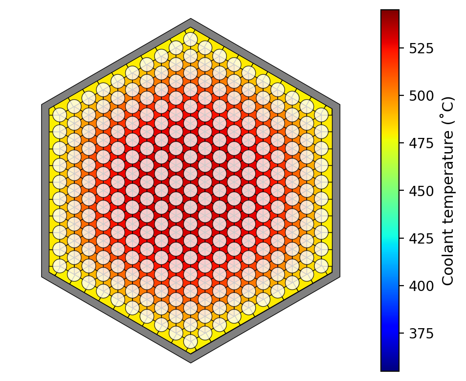
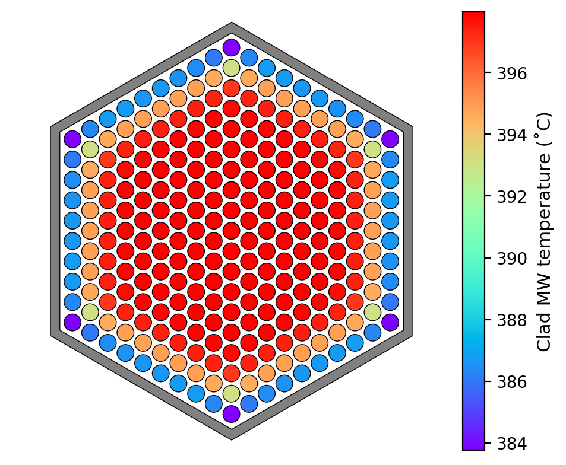
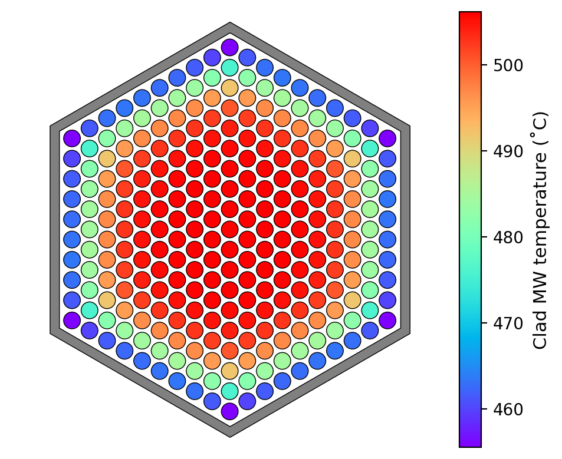

# Example 1: Single-assembly problem
Prepared 2021-06-03 using DASSH v0.6.5

## Introduction

In this problem, we model a single assembly with adiabatic boundary conditions at the outer duct surface. It demonstrates basic input structure and requirements, connection with the binary files generated by ARC to determine the power distribution, the specification of units used for input/output, and the generation of figures.

## Input file overview

The input file is named `input.txt`. Each input block is described below.

The `Setup` block controls the problem environment and user options. For this problem we will make few changes to the default options. We specify the units used for input/output and request that DASSH calculate and tally an energy balance throughout the problem. Additionally, we request that coolant and pin temperatures be dumped to CSV so we can use that data for plotting.

```
[Setup]
    [[Units]]
        temperature    = celsius
        length         = cm
        mass_flow_rate = kg/s
    [[Options]]
        calc_energy_balance = True
        log_progress        = 200
    [[Dump]]
        coolant = True
        pins    = True
```

To connect with power distributions generated by the ARC codes DIF3D/GAMSOR, we need to point DASSH to the binary files they produced. This is done in the `ARC` block, as shown below. The path is relative to the location of the input file.

```
[ARC]
    pmatrx = cccc/PMATRX
    geodst = cccc/GEODST
    ndxsrf = cccc/NDXSRF
    znatdn = cccc/ZNATDN
    labels = cccc/LABELS
    nhflux = cccc/NHFLX0N
    ghflux = cccc/NHFLX0G

```

Next, we'll input some core-wide parameters in the `Core` block; these are values that apply to every assembly and the inter-assembly gap. Setting `gap value` equal to "none" indicates that no heat transfer should take place across the duct wall outer surface. Additionally, we set coolant properties to a built-in set, taken from those built-into SUPERENERGY-2 at constant temperature (425˚C). We normalize the total power in the assembly to 6 MW and indicate that power should only be added to the pins, not to the duct or coolant.

Note that two specifications are required for "coolant": `coolant_material` tells DASSH where to get the material properties for use in the calculation, whereas `coolant_heating` is required for processing the ARC binary files to distribute heat among pins, duct, and coolant and must be one of a fixed set of options.

```
[Core]
    coolant_inlet_temp = 355.0
    fuel_material      = metal
    fuel_alloy         = zr
    coolant_material   = sodium_se2anl_425  # built-in static sodium properties, taken from SE2-ANL
    coolant_heating    = sodium
    length             = 400.0
    gap_model          = none
    assembly_pitch     = 12.000
    bypass_fraction    = 0.0
    total_power        = 6.0e6
    power_model        = pin_only

```

The assembly geometry parameters are input in the `Assembly` block. The assembly name is indicated as a sub-block title (inside two square brackets) and the parameters are nested within that. Only some of these keyword inputs are required inputs; some are optional, although not all optional inputs are shown here. Users are encouraged to consult the user guide to see the full list of input options.

Note: By inputting the `FuelModel` sub-sub-block for fuel, we are requesting that clad/fuel temperatures be calculated. The inputs for `pu_frac`, `zr_frac`, and `porosity` indicate radial distributions of parameters defined for the regions between the fractional radii listed in `r_frac` (with the implied boundary of `r_frac=1.0`).

```
[Assembly]

    [[fuel]]
        num_rings       = 10
        pin_pitch       = 0.6500
        pin_diameter    = 0.5400
        clad_thickness  = 0.0350
        wire_pitch      = 20.320
        wire_diameter   = 0.1000  # 0.1000
        duct_ftf        = 10.960, 11.560
        duct_material   = ht9
        corr_mixing     = MIT
	    corr_friction   = NOV
	    corr_flowsplit  = MIT
	    corr_nusselt    = DB
        htc_params_duct = 0.025, 0.8, 0.8, 7.0
        wire_direction  = counterclockwise
        shape_factor    = 1.0
        [[[FuelModel]]]
            fcgap_thickness = 0.0
            clad_material   = ht9
            r_frac   =  0.0, 0.33333, 0.66667
            pu_frac  = 0.20,    0.20,    0.20
            zr_frac  = 0.10,    0.10,    0.10
            porosity = 0.25,    0.25,    0.25

```

We assign assemblies to core locations in the `Assignment` block, adopting the notation used by DIF3D. The three values following the assembly name are the ring, start position on the ring, and end position on the ring, counting counterclockwise. In this problem there is only one assembly, so only one assignment is given.

In this block, we also assign a condition based on which we can determine the coolant flow rate in each assembly. In DASSH, that can be one of the following options:
1. the coolant mass flow rate in the assembly, with `FLOWRATE`
2. the desired outlet temperature from the assembly, with `OUTLET_TEMP`; using this value, the inlet temperature, the assembly power, and the average heat capacity, the mass flow rate required to achieve this condition is determined.
3. the desired temperature difference from assembly inlet to outlet, with `DELTA_TEMP`; using this value, the inlet temperature, the assembly power, and the average heat capacity, the mass flow rate required to achieve this condition is determined.

```
[Assignment]
    [[ByPosition]]
        fuel = 1, 1, 1, DELTA_TEMP=150.0

```

Finally, in this problem, we include the request for DASSH visualization as a part of this main input file. Four plots are requested:
* Assembly coolant subchannel temperatures at 2 axial positions;
* Assembly clad MW temperatures, for each pin, at 2 axial positions.

For more details on available plot types and the arguments required to generate each one, users are encouraged to consult the DASSH user guide.

```

[Plot]
    [[subchannel_temps]]
        type        = SubchannelPlot
        assembly_id = 1
        z           = 150.0, 350.0
        cmap        = jet
        cbar_lbnd   = 355.0
        cbar_ubnd   = 545.0
        cbar_label  = Coolant temperature (˚C)
        units       = celsius
        pins        = True    # Overlay pins on subchannels
        pin_alpha   = 0.8     # Opacity of pin fill

     [[clad_temps]]
        type        = PinPlot
        value       = clad_mw
        assembly_id = 1
        z           = 150.0, 250.0
        cmap        = rainbow
        cbar_label  = Fuel CL temperature (˚C)
        units       = celsius

```

## Running DASSH

With the input file prepared and the CCCC binary files ready, we can run DASSH. Once installed, DASSH is run from the command line just like any other executable.

```
dassh input.txt

```

During the calculation, DASSH prints information to the terminal to indicate its status. After the title ASCII art, the initial terminal output for this sample problem is shown below:

```
DASSH....DASSH logger initialized
DASSH....Reading input: input.txt
DASSH....Setting up power distribution
DASSH....Calculating core power profile from CCCC binary files
DASSH....Generating Assembly objects
DASSH....    Assembly "fuel" param "number of rods in bundle" is outside the acceptable range for correlation "friction_nov"
DASSH....Generating Core object
DASSH....Total power (W): 6000000.0
DASSH....Total flow rate (kg/s): 31.3932
DASSH....Axial step size required (m): 0.025976
DASSH....Reducing step size to improve accuracy; new step size (m): 0.01
DASSH....400 axial steps required
DASSH....Performing temperature sweep...
DASSH....Dumping temperatures at every axial step
DASSH....Dumping interior coolant temperatures to "temp_coolant_int.csv"
DASSH....Dumping pin temperatures to "temp_pin.csv"
DASSH....Progress: plane  200 of 400; z = 2.00 m; cumulative sweep time = 00:00:00.61
DASSH....Progress: plane  400 of 400; z = 4.00 m; cumulative sweep time = 00:00:01.20
DASSH....Temperature sweep complete
DASSH....Output written
DASSH....Generating figures
DASSH....DASSH execution complete

```
DASSH first reads the input, then sets up the power distribution from the CCCC binary files from ARC. Then, `Assembly` objects (one for each assembly in the core) are created. Here, DASSH warns that the number of rods in the fuel assembly bundle is outside the reported range of applicability for the correlations selected.

Next, DASSH reports a summary of the problem setup, including total power, total flow rate, axial step size, and the number of steps in the axial sweep. After indicating the destination for "dumped" temperatures, DASSH performs the sweep, logging progress as requested in the input.

Once the sweep has concluded, DASSH generates the figures requested in the input file. If the necessary data has not been dumped to CSV, DASSH will return a warning like this:

```
........File "temp_coolant_int.csv" not found, skipping...

```

## Results

DASSH produces multiple files during execution. The main output file generated by DASSH is `dassh.out`, which contains a summary of inputs, system conditions, and an overview of the results. The CSVs containing the detailed dumped data are saved in the working directory as well (but not uploaded to this repo).

The output file reports that the bulk outlet temperature from the assembly is 505˚C. This result corresponds exactly to the 150˚C temperature rise requested in the input, which was used to calculate the assembly flow rate. Because no heat was transferred from the assembly, the approximation was exact.

Other output files generated by DASSH include:
* a log of messages collected during execution (similar to what is printed to the screen);
* multiple files (with "VARPOW" in the name) associated with the processing of CCCC binary files into a DASSH power distribution;
* and a binary file called `dassh_reactor.pkl` that stores the system information used by DASSH in the calculation and is used to generate figures after execution.

## Visualization

Below are the four figures we generated with the above input:


*Coolant subchannel temperatures at 150 cm*



*Coolant subchannel temperatures at 350 cm*



*Clad MW temperatures at 150 cm*



*Clad MW temperatures at 250 cm*
