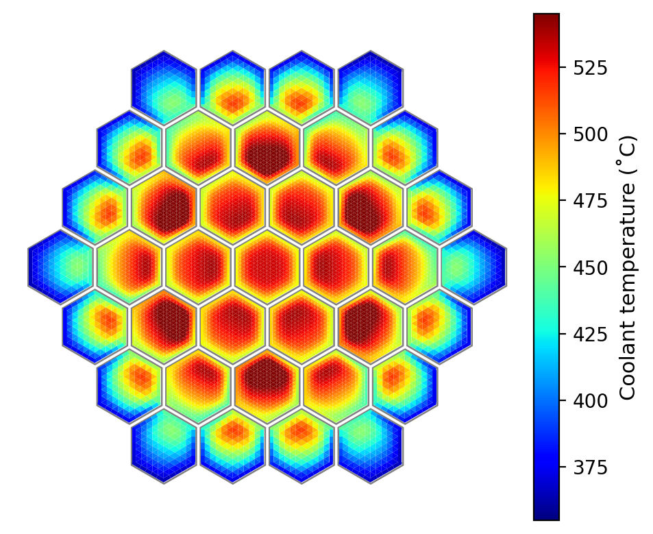
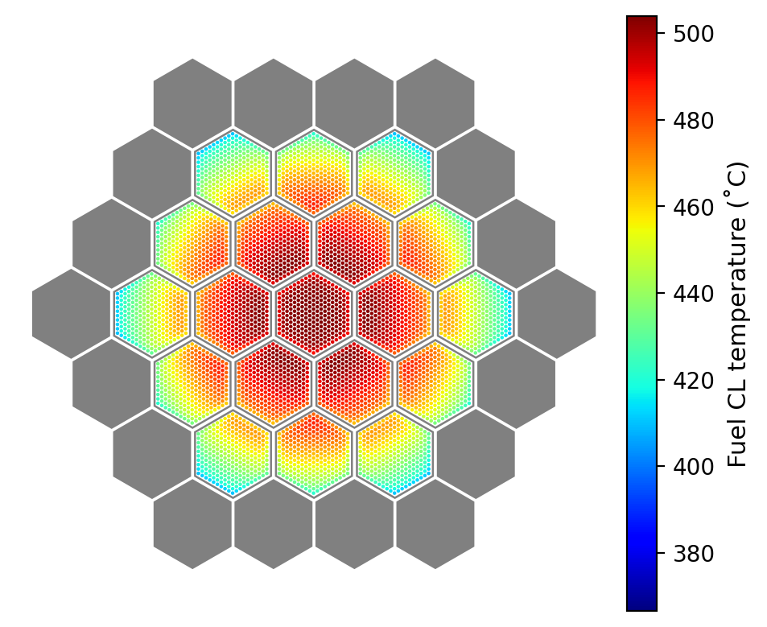
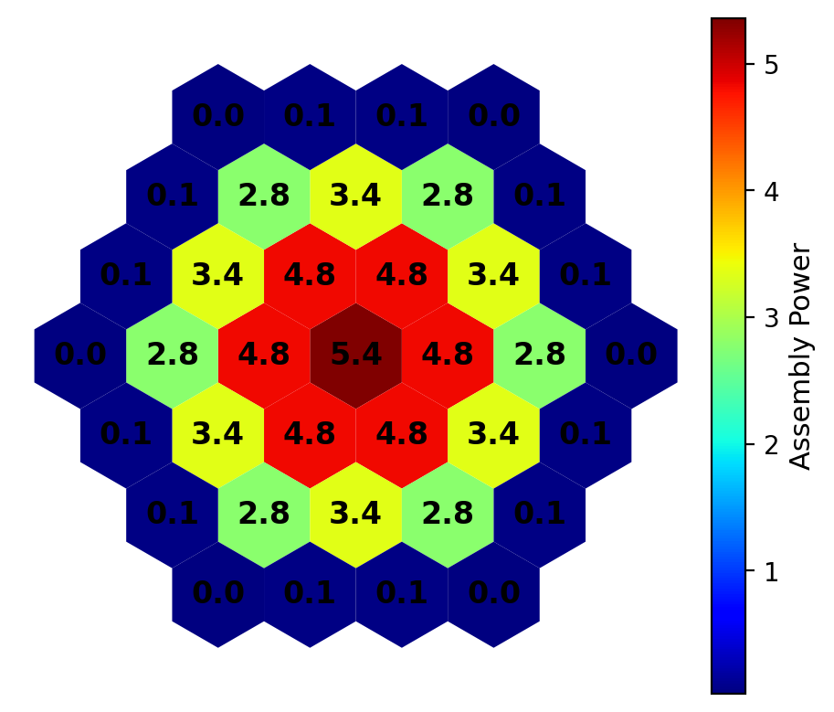
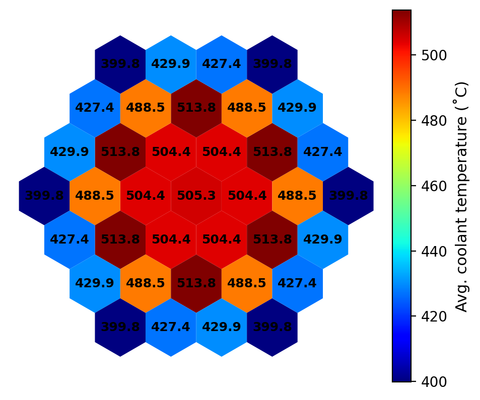

# Example 2: 37-assembly problem
Prepared 2021-06-03 using DASSH v0.6.5

## Introduction

In this problem, we model a hypothetical system of 37 assemblies in which 19 fuel assemblies are surrounded by an outer ring of 18 reflectors. It demonstrates how to specify material properties, how to dump data to CSVs, how to connect DASSH with ARC binary files, and how to assign assemblies to core locations.

## Input file overview

The input file is named `input.txt`. Each input block is described below.

The `Setup` block controls the problem environment and user options. For this problem we specify the units used for input/output, some options to control the calculation, and indicate to DASSH that we'd like it to dump various types of temperature data to CSVs.

```
[Setup]
    [[Units]]
        temperature    = celsius
        length         = cm
        mass_flow_rate = kg/s
    [[Options]]
        log_progress          = 50
        calc_energy_balance   = True
        conv_approx           = True
        conv_approx_dz_cutoff = 0.1
    [[Dump]]
        coolant  = True
        average  = True
        maximum  = True
        pins     = True
        duct     = True
        interval = 10.0

```

In the `Materials` block, we specify material properties for the coolant (sodium) and the structural material (HT9 stainless steel). Here, we input properties as coefficients to a polynomial of the form `a0 + a1 * T + a2 * T^2 + ...`, where T is temperature. In this problem, we'll use static material properties, so the input value is just for `a0`. Only thermal conductivity is required for structural material, but coolant also requires viscosity, heat capacity, and density.

```
[Materials]
    [[sodium_x]]
        thermal_conductivity = 75.35648125
        viscosity            = 0.000330604
        heat_capacity        = 1297.485560
        density              = 874.0794169
    [[ht9_x]]
        thermal_conductivity = 26.06656550

```

To connect with power distributions generated by the ARC codes DIF3D/GAMSOR, we need to point DASSH to the binary files they produced. This is done in the `ARC` block, as shown below. The path is relative to the location of the input file.

```
[ARC]
    pmatrx = cccc/PMATRX
    geodst = cccc/GEODST
    ndxsrf = cccc/NDXSRF
    znatdn = cccc/ZNATDN
    labels = cccc/LABELS
    nhflux = cccc/NHFLX0N
    ghflux = cccc/NHFLX0G

```

Next, we'll input some core-wide parameters in the `Core` block; these are values that apply to every assembly and the inter-assembly gap. Here we specify that we'll use a flowing inter-assembly gap system in which the total gap flow rate is 1% of the core-wide total.

Note that two specifications are required for "coolant": `coolant_material` tells DASSH where to get the material properties for use in the calculation, whereas `coolant_heating` is required for processing the ARC binary files to distribute heat among pins, duct, and coolant and must be one of a fixed set of options.

```
[Core]
    coolant_inlet_temp = 355.0
    fuel_material      = metal
    fuel_alloy         = zr
    coolant_material   = sodium_x
    coolant_heating    = sodium
    length             = 400.00
    gap_model          = flow
    bypass_fraction    = 0.01
    assembly_pitch     = 12.000
    total_power        = 72.0e6
    # power_model        = pin_only

```

The assembly geometry parameters are input in the `Assembly` block. We're defining two types of assemblies: one fuel assembly and one reflector assembly, defined as sub-blocks. Only some of these keyword inputs are required inputs; some are optional, although not all optional inputs are shown here. Users are encouraged to consult the user guide to see the full list of input options.

Note: By inputting the `FuelModel` sub-sub-block for fuel, we are requesting that clad/fuel temperatures be calculated.

```
[Assembly]

    [[fuel]]
        num_rings       = 10
        pin_pitch       = 0.6500
        pin_diameter    = 0.5400
        clad_thickness  = 0.0350
        wire_pitch      = 20.320
        wire_diameter   = 0.1000
        duct_ftf        = 10.960, 11.560
        duct_material   = ht9_x
        htc_params_duct = 0.025, 0.8, 0.8, 7.0
        wire_direction  = counterclockwise
        shape_factor = 1.1
        [[[FuelModel]]]
            fcgap_thickness = 0.0
            clad_material   = HT9_se2anl
            r_frac   =  0.0, 0.33333, 0.66667
            pu_frac  = 0.20,    0.20,    0.20
            zr_frac  = 0.10,    0.10,    0.10
            porosity = 0.25,    0.25,    0.25

    [[reflector]]
        num_rings       = 6
        pin_pitch       = 1.1200
        pin_diameter    = 1.0950
        clad_thickness  = 0.1006
        wire_pitch      = 20.419
        wire_diameter   = 0.0123
        duct_ftf        = 10.960, 11.560
        duct_material   = ht9_x
        htc_params_duct = 0.025, 0.8, 0.8, 7.0
        wire_direction  = counterclockwise

```

Finally, we'll assign assemblies to core locations in the `Assignment` block, adopting the notation used by DIF3D. The three values following the assembly name are the ring, start position on the ring, and end position on the ring, counting counterclockwise. Therefore in this problem, the entire first ring, second ring, and third ring are filled with fuel assemblies and the fourth ring is filled with reflector assemblies.

In this block, we also assign a condition based on which we can determine the coolant flow rate in each assembly. In DASSH, that can be one of the following options:
1. the coolant mass flow rate in the assembly, with `FLOWRATE`
2. the desired outlet temperature from the assembly, with `OUTLET_TEMP`; using this value, the inlet temperature, the assembly power, and the average heat capacity, the mass flow rate required to achieve this condition is determined.
3. the desired temperature difference from assembly inlet to outlet, with `DELTA_TEMP`; using this value, the inlet temperature, the assembly power, and the average heat capacity, the mass flow rate required to achieve this condition is determined.

```
[Assignment]
    [[ByPosition]]
        fuel      = 1,  1,  1, FLOWRATE = 27.5
        fuel      = 2,  1,  6, FLOWRATE = 25.0
        fuel      = 3,  1, 12, FLOWRATE = 16.0
        reflector = 4,  1, 18, FLOWRATE = 0.50

```

## Running DASSH

With the input file prepared and the CCCC binary files ready, we can run DASSH. Once installed, DASSH is run from the command line just like any other executable.

```
dassh input.txt --save_reactor

```

The `--save_reactor` flag tells DASSH to save the main Python `Reactor` object as a binary file; this is essential if plots will be generated after the calculation.

During the calculation, DASSH prints information to the terminal to indicate its status. After the title ASCII art, the initial terminal output for this sample problem is shown below:

```
DASSH....DASSH logger initialized
DASSH....Reading input: input.txt
DASSH....Setting up power distribution
DASSH....Calculating core power profile from CCCC binary files
DASSH....Generating Assembly objects
DASSH....    Assembly "fuel" param "number of rods in bundle" is outside the acceptable range for correlation "friction_ctd"
DASSH....    Assembly "fuel" param "number of rods in bundle" is outside the acceptable range for correlation "flowsplit_ctd"
DASSH....Assembly 19 mesh size requirement 3-22 is too small (dz = 4.72e-04 m);
DASSH....    Treating duct wall connection with  modified approach that yields dz = 5.44e-03 m.
DASSH....Assembly 20 mesh size requirement 3-22 is too small (dz = 4.72e-04 m);
DASSH....    Treating duct wall connection with  modified approach that yields dz = 5.44e-03 m.
DASSH....Assembly 21 mesh size requirement 3-22 is too small (dz = 4.72e-04 m);
DASSH....    Treating duct wall connection with  modified approach that yields dz = 5.44e-03 m.
DASSH....Assembly 22 mesh size requirement 3-22 is too small (dz = 4.72e-04 m);
DASSH....    Treating duct wall connection with  modified approach that yields dz = 5.44e-03 m.
DASSH....Assembly 23 mesh size requirement 3-22 is too small (dz = 4.72e-04 m);
DASSH....    Treating duct wall connection with  modified approach that yields dz = 5.44e-03 m.
DASSH....Assembly 24 mesh size requirement 3-22 is too small (dz = 4.72e-04 m);
DASSH....    Treating duct wall connection with  modified approach that yields dz = 5.44e-03 m.
DASSH....Assembly 25 mesh size requirement 3-22 is too small (dz = 4.72e-04 m);
DASSH....    Treating duct wall connection with  modified approach that yields dz = 5.44e-03 m.
DASSH....Assembly 26 mesh size requirement 3-22 is too small (dz = 4.72e-04 m);
DASSH....    Treating duct wall connection with  modified approach that yields dz = 5.44e-03 m.
DASSH....Assembly 27 mesh size requirement 3-22 is too small (dz = 4.72e-04 m);
DASSH....    Treating duct wall connection with  modified approach that yields dz = 5.44e-03 m.
DASSH....Assembly 28 mesh size requirement 3-22 is too small (dz = 4.72e-04 m);
DASSH....    Treating duct wall connection with  modified approach that yields dz = 5.44e-03 m.
DASSH....Assembly 29 mesh size requirement 3-22 is too small (dz = 4.72e-04 m);
DASSH....    Treating duct wall connection with  modified approach that yields dz = 5.44e-03 m.
DASSH....Assembly 30 mesh size requirement 3-22 is too small (dz = 4.72e-04 m);
DASSH....    Treating duct wall connection with  modified approach that yields dz = 5.44e-03 m.
DASSH....Assembly 31 mesh size requirement 3-22 is too small (dz = 4.72e-04 m);
DASSH....    Treating duct wall connection with  modified approach that yields dz = 5.44e-03 m.
DASSH....Assembly 32 mesh size requirement 3-22 is too small (dz = 4.72e-04 m);
DASSH....    Treating duct wall connection with  modified approach that yields dz = 5.44e-03 m.
DASSH....Assembly 33 mesh size requirement 3-22 is too small (dz = 4.72e-04 m);
DASSH....    Treating duct wall connection with  modified approach that yields dz = 5.44e-03 m.
DASSH....Assembly 34 mesh size requirement 3-22 is too small (dz = 4.72e-04 m);
DASSH....    Treating duct wall connection with  modified approach that yields dz = 5.44e-03 m.
DASSH....Assembly 35 mesh size requirement 3-22 is too small (dz = 4.72e-04 m);
DASSH....    Treating duct wall connection with  modified approach that yields dz = 5.44e-03 m.
DASSH....Assembly 36 mesh size requirement 3-22 is too small (dz = 4.72e-04 m);
DASSH....    Treating duct wall connection with  modified approach that yields dz = 5.44e-03 m.
DASSH....Generating Core object
DASSH....Total power (W): 72000000.0
DASSH....Total flow rate (kg/s): 382.3232
DASSH....Axial step size required (m): 0.00432
DASSH....960 axial steps required
DASSH....Performing temperature sweep...
DASSH....Dumping temperatures with interval of 0.100000 m and at all requested axial positions
DASSH....Dumping interior coolant temperatures to "temp_coolant_int.csv"
DASSH....Dumping duct mid-wall temperatures to "temp_duct_mw.csv"
DASSH....Dumping interassembly gap coolant temperatures to "temp_coolant_gap.csv"
DASSH....Dumping pin temperatures to "temp_pin.csv"
DASSH....Dumping average coolant and pin temperatures to "temp_average.csv"
DASSH....Dumping maximum coolant and pin temperatures to "temp_maximum.csv"
DASSH....Progress: plane   50 of 960; z = 0.21 m; cumulative sweep time = 00:00:01.12
DASSH....Progress: plane  100 of 960; z = 0.42 m; cumulative sweep time = 00:00:02.25
DASSH....Progress: plane  150 of 960; z = 0.63 m; cumulative sweep time = 00:00:03.40
DASSH....Progress: plane  200 of 960; z = 0.83 m; cumulative sweep time = 00:00:04.57
DASSH....Progress: plane  250 of 960; z = 1.04 m; cumulative sweep time = 00:00:05.76
DASSH....Progress: plane  300 of 960; z = 1.25 m; cumulative sweep time = 00:00:07.06
DASSH....Progress: plane  350 of 960; z = 1.46 m; cumulative sweep time = 00:00:08.40
DASSH....Progress: plane  400 of 960; z = 1.67 m; cumulative sweep time = 00:00:09.71
DASSH....Progress: plane  450 of 960; z = 1.88 m; cumulative sweep time = 00:00:11.03
DASSH....Progress: plane  500 of 960; z = 2.09 m; cumulative sweep time = 00:00:12.34
DASSH....Progress: plane  550 of 960; z = 2.30 m; cumulative sweep time = 00:00:13.66
DASSH....Progress: plane  600 of 960; z = 2.50 m; cumulative sweep time = 00:00:15.04
DASSH....Progress: plane  650 of 960; z = 2.71 m; cumulative sweep time = 00:00:16.36
DASSH....Progress: plane  700 of 960; z = 2.92 m; cumulative sweep time = 00:00:17.69
DASSH....Progress: plane  750 of 960; z = 3.13 m; cumulative sweep time = 00:00:18.91
DASSH....Progress: plane  800 of 960; z = 3.33 m; cumulative sweep time = 00:00:20.12
DASSH....Progress: plane  850 of 960; z = 3.54 m; cumulative sweep time = 00:00:21.30
DASSH....Progress: plane  900 of 960; z = 3.75 m; cumulative sweep time = 00:00:22.41
DASSH....Progress: plane  950 of 960; z = 3.96 m; cumulative sweep time = 00:00:23.50
DASSH....Temperature sweep complete
DASSH....Output written
DASSH....DASSH execution complete

```

DASSH first reads the input, then sets up the power distribution from the CCCC binary files from ARC. Then, `Assembly` objects (one for each assembly in the core) are created. Here, DASSH warns that the number of rods in the fuel assembly bundle is outside the reported range of applicability for the correlations selected (Cheng-Todreas correlations are the default).

Next, DASSH calculates the axial mesh size constraint required for numerical stability in each assembly. The reflector assemblies have an axial mesh size constraint in the corner subchannels that is below the cutoff value indicated in the input file. Therefore, a modified approach to convection with the duct wall is used. In the modified approach, energy transfer from the duct wall occurs based on the duct mid-wall temperature rather than the duct surface temperature; a lumped thermal resistance based on the duct thermal conductivity and wall heat transfer coefficient is used. This results in a relaxation of the axial constraint by about an order of magnitude.

Finally, DASSH reports a summary of the problem setup, including total power, total flow rate, axial step size, and the number of steps in the axial sweep. After indicating the destination for "dumped" temperatures, DASSH performs the sweep, logging progress as requested in the input.

## Results

DASSH produces multiple files during execution. The main output file generated by DASSH is `dassh.out`, which contains a summary of inputs, system conditions, and an overview of the results. The CSVs containing the detailed dumped data are saved in the working directory as well (but not uploaded to this repo).

Others include: a log of messages collected during execution (similar to what is printed to the screen); multiple files (with "VARPOW" in the name) associated with the processing of CCCC binary files into a DASSH power distribution; and the saved `Reactor` object, called `dassh_reactor.pkl`.

## Visualization

DASSH can plot data based on the saved `dassh_reactor.pkl` object and the CSVs generated during the axial sweep. Plots can be requested in the primary input file, or can be requested after problem execution in a separate file. This section shows how to request plots separately from the main problem execution using the `input_plot.txt` file, the contents of which are detailed below.

First, the user can specify the units to be used in the plotting input: in particular, if the user wants to specify different length or temperature units than used in the original DASSH input, they should indicate that here. If omitted, the default behavior is to use the values from the original input file, which are saved in the `dassh_reactor.pkl` object. For this input, this section can be omitted because we use the units from the original input file.

```
[Setup]
    [[Units]]
        temperature    = celsius
        length         = cm
        mass_flow_rate = kg/s

```

Then, all that's left to do is to request figures. In this example, we request:
* Core-wide coolant subchannel temperatures at 3 axial positions;
* Core-wide fuel centerline temperatures at 3 axial positions;
* Hex-plots showing, for each assembly: (a) the total power; (b) peak duct temperature; and (c) the average coolant outlet temperature.

Details on available plot types and the arguments required to generate each one are available in the DASSH user guide.

```
[Plot]
     [[subchannel_temps]]
        type       = CoreSubchannelPlot
        z          = 200.0, 350.0
        cmap       = jet
        cbar_lbnd  = 355.0
        cbar_ubnd  = 545.0
        cbar_label = Coolant temperature (˚C)
        units      = celsius

     [[fuel_temps]]
        type       = CorePinPlot
        value      = fuel_cl
        z          = 150.0, 250.0
        cbar_label = Fuel CL temperature (˚C)
        units      = celsius

     [[asm_power]]
         type        = CoreHexPlot
         value       = total_power
         cbar_label  = Assembly Power

     [[avg_outlet_coolant_temp]]
         type        = CoreHexPlot
         value       = avg_coolant_temp
         z           = 400.0
         cbar_label  = Avg. coolant temperature (˚C)
         units       = celsius

```

The following command demonstrates the invocation of the standalone DASSH plotting utility.

```
dassh_plot input_plot.txt

```

A subset of the generated figures are shown here:

  
*Coolant subchannel temperatures at 350 cm*


  
*Fuel centerline temperatures at 150 cm*


  
*Assembly total power (MW)*


  
*Assembly average coolant outlet temperature*
