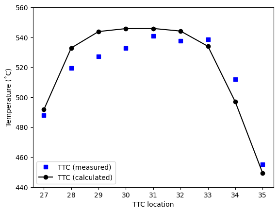
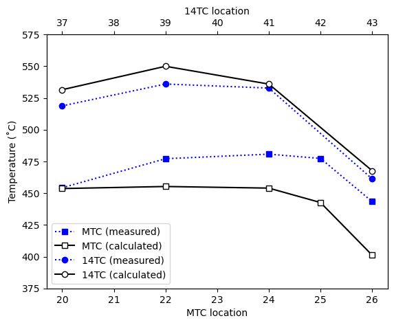

# Example 3: User-defined power distribution
Prepared 2021-06-08 using DASSH v0.6.7

## Introduction

In this problem, we demonstrate how the user can specify power distributions to DASSH without coupling through ARC binary files. For that, we model the XX09 instrumented test subassembly used in EBR-II. First, we prepare the pin power distribution from publicly available sources. Then, we prepare the DASSH input, run the problem, and compare the output with measurement.

## XX09 power distribution setup

DASSH accepts user-defined power distributions (W/cm) for each pin (and duct element and coolant subchannel, if applicable) in the form of polynomials in `z`. This section documents how publicly available information about XX09 can be used to set up a power distribution for DASSH, saved as `xx09_pin_power.csv`.

XX09 was a 61-pin instrumented subassembly loaded into EBR-II. XX09 was loaded in EBR-II within a thimble tube, making it a double-ducted assembly. Figure 1 shows a cross-section of XX09 along with the locations of the thermocouples used to measure coolant temperatures. Of the 61-pins, 59 are Mark-II driver fuel pins, and the remaining 2 are unfueled. The height of the XX09 assembly is 0.612 m. Of that, the first 0.343 m are the fueled region and the remaining height is the plenum. An adiabatic boundary condition is assumed at the outer surface of the exterior duct.

  
*Radial cross section of XX09 instrumented test subassembly showing location of thermocouples*

Previous works that used XX09 data to validate numerical models assumed a cosine distribution with an initially constant radial profile. We will recreate this power shape using a quadratic polynomial. For this problem, we assume a constant radial profile (all pins have the same axial profile). We assume the power distribution peaks at the center of the fueled region. We define the axial space such that `z = 0` is the center of the fueled region. With that, the power shape in `z` will be of the form:

```
q'(z) = Az^2 + C
```

Note that the term `Bx` is omitted; it equals zero because the distribution is centered at `z = 0`. To determine `A` and `C` we need information about the XX09 power distribution. We assume XX09 has a total power of 486.2 kW [1], its power at the steady-state condition preceding the SHRT-17 test. It was reported that the peak linear power in XX09 is 25.6 kW/m for the assembly when operating at 468 kW (nominal) [2]. With that information, we can determine that:

* `q'(z=0) = 265.96 W/cm = q'_max` at the fuel mid-plane (the given peak linear power scaled by `486.2 / 486.0`); therefore, we know `C = 265.96 W/cm`.
* The integral of `q'(z)` must equal `486.2 kW / 59 pins = 8240.68 W = q_tot`

Evaluation of the integral of `q'(z)`between `z0 = -L/2` and `z1 = L/2` (where `L = 34.3 cm`), then solving for `A` yields:

```
A = 3 * (q_tot - q'_max * (z1-z0)) / (z1^3 - z0^3)

# Substituting z0 = -L/2 and z1 = L/2 and reducing:
A = 12 * (q_tot - q'_max * L) / L^3

```


Now, we need to transform the equation to be on the range of `-0.5` to `0.5`, which is the unit space for power distributions used by DASSH. We assume that there's a factor `k` that multiplies by `z` in `q'(z)` to perform the transformation. So as to not modify the distribution, we'll normalize each term by `k` raised to the proper polynomial exponent, essentially "multiplying by 1":

```
q'(z) = A(kz)^2 / k^2 + C
```

For the transform we desire, `k = 1 / L`. Note that after the transformation, if `z = (-L / 2)`, then `kz = -0.5`; conversely if `z = (L / 2)`, then `kz = 0.5`. We can treat `kz` as the independent variable `z*` and incorporate the normalizing factor into `A` with:

```
A = 12 * (q_tot - q'_max * L) / L^3 / (1 / L)^2
A = 12 * (q_tot - q'_max * L) / L

```
With that, and the values for `q_tot` and `q'_max`, we can create the power distribution for the 59 fueled pins in XX09. We assume that the two unfueled pins generate no power. We also assume that no power is generated in the plenum region.

The resulting power distribution data is contained in `xx09_pin_power.csv`. The CSV is organized as follows:
* The first column in the CSV is the assembly number. Because this is a single-assembly problem, all values equal 1.
* The next column indicates the "component" to which the power distribution applies: (1) pin; (2) duct; or (3) coolant. Because we are only including the pin power distribution, all values are 1.
* The next two columns are the lower and upper boundary of the power distribution axial region. All pins, duct elements, and coolant subchannels must have identical region definitions, with no "gaps" between subsequent regions. This problem has two regions: fuel and plenum.
* Next is the "component ID"; in this case, because we are modeling pins, these values are the pin numbers.
* Finally, the remaining columns are the coefficients associated with the polynomial power distribution in `z`, starting with the zero-th term.


#### References

1. T. Sumner and T. Y. C. Wei. "Benchmark Specifications and Data Requirements for EBR-II Shutdown Heat Removal Tests SHRT-17 and SHRT-45R". ANL-ARC-226 (Rev 1), 2012. [URL](https://publications.anl.gov/anlpubs/2012/06/73647.pdf).
2. G. H. Golden, H. P. Planchon, J. I. Sackett, and R. M. Singer. "Evolution of Thermal-Hydraulics Testing in EBR-II". Nuclear Engineering and Design v. 101 pp 3-12, 1987. [URL](https://www.sciencedirect.com/science/article/pii/0029549387901452).


## DASSH input setup


The input file is named `input.txt`. Each input block is described below.

The `Setup` block controls the problem environment and user options.

```
[Setup]
    [[Units]]
        temperature    = celsius
        length         = cm
        mass_flow_rate = kg/s
    [[Options]]
        calc_energy_balance = True
        log_progress        = 100
    [[Dump]]
        coolant = True

```

The `Power` block is used to point to the path of the CSV that contains the power distributions we made in the previous section.
```
[Power]
    user_power = xx09_pin_power.csv

```

Next, we'll input some core-wide parameters in the `Core` block; these are values that apply to every assembly and the inter-assembly gap. Setting `gap value` equal to "none" indicates that no heat transfer should take place across the duct wall outer surface. Additionally, we set coolant properties to a built-in set, taken from those built-into SUPERENERGY-2 at constant temperature (425˚C). We normalize the total power in the assembly to 6 MW and indicate that power should only be added to the pins, not to the duct or coolant.

Note that two specifications are required for "coolant": `coolant_material` tells DASSH where to get the material properties for use in the calculation, whereas `coolant_heating` is required for processing the ARC binary files to distribute heat among pins, duct, and coolant and must be one of a fixed set of options.

```
[Core]
    coolant_inlet_temp = 351.55     # Inlet temperature to the reactor
    fuel_material      = metal
    fuel_alloy         = zr
    coolant_material   = sodium
    coolant_heating    = sodium
    length             = 61.2       # We're only modeling the pin-bundle length
    gap_model          = none
    assembly_pitch     = 5.8929
    bypass_fraction    = 0.0
    total_power        = 486.2e3    # Normalize power distribution to this value
```

The assembly geometry parameters are input in the `Assembly` block. Here, we specify the geometry of the XX09 test subassembly, including both duct walls. The value of `shape_factor` is calculated based on the "conduction factor" relationship proposed by Cheng: `0.66 * (P / D) * ((P - D) / D)^-0.3`.

```
[Assembly]

    [[xx09]]
        num_rings       = 5
        pin_pitch       = 0.5664                          # [3] (Figure A.22)
        pin_diameter    = 0.4419                          # [1]
        clad_thickness  = 0.0305                          # [1]
        wire_pitch      = 15.2                            # [2]
        wire_diameter   = 0.124                           # [1]
        wire_direction  = counterclockwise
        duct_ftf        = 4.6400, 4.8437, 5.6134, 5.8166  # [3]
        duct_material   = ss304                           # [3]
        corr_mixing     = MIT
        corr_friction   = CTD
        corr_flowsplit  = CTD
        corr_nusselt    = DB
        shape_factor    = 1.25                            # From Cheng [4]
        htc_params_duct = 0.025, 0.8, 0.8, 7.0
        bypass_gap_flow_fraction = 0.09                   # Expert input from E. Feldman
        [[[FuelModel]]]
            clad_material   = ss316                       # [1]
            gap_material    = sodium                      # [1]
            fcgap_thickness = 0.0254                      # [1]
            r_frac   =   0.0, 0.33333, 0.66667
            pu_frac  = 0.000,   0.000,   0.000
            zr_frac  = 0.001,   0.001,   0.001            # [3]
            porosity = 0.000,   0.000,   0.000

```

We assign assemblies to core locations in the `Assignment` block, but for this model this is trivial because there is only one assembly. However, here we assign the flow rate to the assembly. It has been noted that the coolant flow rate in the pin-bundle region of XX09 at the beginning of the SHRT-17 test was 2.45 kg/s [5]. However, our model also accounts for coolant flow in the bypass gap. Based on expert input from E. Feldman, the coolant flow rate in this region was estimated to be roughly 8-10% of the assembly total flow rate. Given this information, we can calculate the assembly total flow rate by: `FLOWRATE = 2.45 [kg/s] / (1 - 0.09) = 2.6923 [kg/s]`.

```
[Assignment]
    [[ByPosition]]
        xx09 = 1, 1, 1, FLOWRATE=2.6923
```

#### References
1. L. K. Chang and E. E. Feldman. "Experiment Description and Safety Analysis for the Instrumented Fueled Subassembly XX09". December, 1982.
2. R. M. Singer, H. P. Planchon, P. R. Betten, L. K. Chang, E. E. Feldman, D. Mohr. "Decay heat removal and dynamic plant testing at EBR-II". Second Specialists Meeting on Decay Heat Removal and Natural Convection in LMFBRs, Upton, NY, April 17-19, 1985. [URL](https://www.osti.gov/servlets/purl/5900075).
3. T. Fei, A. Mohamed, and T. K. Kim. "Neutronics Benchmark Specifications for EBR-II Shutdown Heat Removal Test SHRT-45-R (Rev. 1)". ANL-ARC-228 Rev. 1 (2013). [URL](https://publications.anl.gov/anlpubs/2018/05/143362.pdf).
4. S. K. Cheng. "Constitutive Correlations for Wire-Wrapped Subchannel Analysis Under Forced and Mixed Convection Conditions". PhD Thesis, Massachusetts Institute of Technology (1984). [URL](https://www.researchgate.net/publication/254987898_Constitutive_correlations_for_wire-wrapped_subchannel_analysis_under_forced_and_mixed_convection_conditions_Part_1_LMFBR)."
5. H. Mochizuki, K. Muranaka. "Benchmark analyses for EBR-II shutdown heat removal tests SHRT-17 and SHRT-45R – (2) subchannel analysis of instrumented fuel subassembly". Nuclear Engineering and Design v 330, pp 14-27, 2018. [URL](https://www.sciencedirect.com/science/article/abs/pii/S0029549318300256).

## Running DASSH


With the input file prepared, we can run DASSH. Once installed, DASSH is run from the command line just like any other executable.

```
dassh input.txt --save_reactor

```

During the calculation, DASSH prints information to the terminal to indicate its status. After the title ASCII art, the initial terminal output for this sample problem is shown below:

```
DASSH....DASSH logger initialized
DASSH....Reading input: input.txt
DASSH....Setting up power distribution
DASSH....Generating Assembly objects
DASSH....Generating Core object
DASSH....Total power (W): 486200.0
DASSH....Total flow rate (kg/s): 2.6923
DASSH....Axial step size required (m): 0.00625
DASSH....99 axial steps required
DASSH....Performing temperature sweep...
DASSH....Dumping temperatures at every axial step
DASSH....Dumping interior coolant temperatures to "temp_coolant_int.csv"
DASSH....Dumping bypass coolant temperatures to "temp_coolant_byp.csv"
DASSH....Temperature sweep complete
DASSH....Output written
DASSH....DASSH execution complete
```

Results are saved in the `dassh.out` summary output file and the dumped CSVs containing detailed coolant temperature data. The `dassh_reactor.pkl` binary object is also saved (but not uploaded to this repo).

## Results

We can query the data saved in the CSVs to compare it with the measured temperatures from the steady-state period that preceded the SHRT-17 test. The results for the TTC, MTC, and 14TC thermocouples are shown below. The agreement is okay - about the same as what's shown by Mochizuki. The measured data and the scripts used to generate these figures are not included in this repository.


  
*Comparison of DASSH result and measurement at the locations of the TTC thermocouples in XX09 for the steady-state period preceding the SHRT-17 test.*


  
*Comparison of DASSH result and measurement at the locations of the MTC and 14TC thermocouples in XX09 for the steady-state period preceding the SHRT-17 test.*
